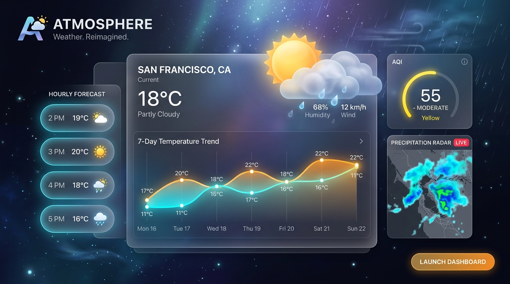
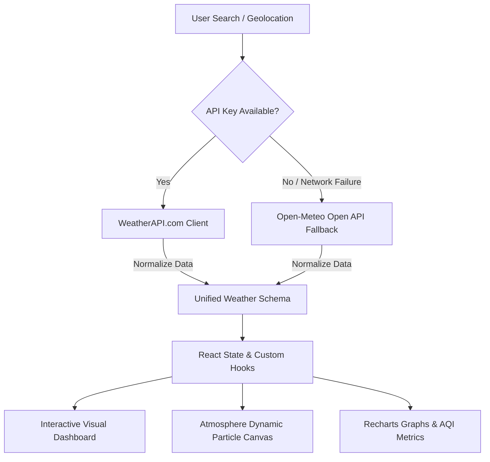

<div align="center">

# 🌤️ Atmosphere
### *Modern Real-Time Weather Intelligence & Atmospheric Canvas*

[](https://codexanjan.github.io/atmosphere/)
[](https://github.com/codexanjan/atmosphere/stargazers)
[](https://github.com/codexanjan/atmosphere/network/members)
[](https://opensource.org/licenses/MIT)

<p align="center">
  <b>A hyper-responsive, fluid, glassmorphic weather forecasting intelligence dashboard built with React 18, Vite, Lucide Icons, and Recharts.</b>
</p>

<p align="center">
  <a href="#-key-features">Key Features</a> •
  <a href="#-live-demo">Live Demo</a> •
  <a href="#-tech-stack">Tech Stack</a> •
  <a href="#-architecture">Architecture</a> •
  <a href="#-quick-start">Quick Start</a> •
  <a href="#-deployment">Deployment</a> •
  <a href="#-author">Author</a>
</p>

<p align="center">
  
</p>

</div>

---

## ⚡ Why Atmosphere?

Atmosphere isn't just another weather widget — it's a **complete atmospheric command center**. Powered by a **zero-config dual-engine fallback architecture**, it pulls high-resolution meteorological models in real time, visualizes temperature trends with interactive gradient graphs, calculates solar trajectories, tracks air quality (AQI) with pollutant breakdowns, and immerses users with dynamic particle weather canvases.

---

## ✨ Key Features

| Feature | Description |
| :--- | :--- |
| **🔍 Instant Global Search** | Search any city, capital, or region worldwide with debounced autocomplete suggestions & full keyboard navigation. |
| **📍 1-Click GPS Geolocation** | Instant device-based geolocation lookup with intelligent fallback and permission recovery. |
| **🌡️ Real-Time Hero Card** | Dynamic condition badge, animated weather icon, "feels-like" metrics, timezone-adjusted local time, and daily min/max. |
| **📊 8 Detailed Metric Cards** | Humidity, Wind Velocity & Direction, UV Index with sun safety advice, Atmospheric Clarity, Pressure, Cloud Cover, Dew Point, and Precipitation. |
| **⏱️ 24-Hour Hourly Track** | Scrollable 24-hour carousel with hourly condition icons, exact temperatures, and rain probability. |
| **📅 7-Day Extended Forecast** | Comprehensive 7-day outlook with proportional gradient temperature bars and precipitation likelihood. |
| **📈 Interactive Recharts** | High-precision interactive area charts for temperature gradients and bar charts for precipitation probabilities. |
| **🌅 Solar Arc & Daylight Cycle** | Real-time solar trajectory simulation displaying exact daylight duration, sunrise, and sunset times. |
| **🍃 Air Quality Index (AQI)** | EPA-standard AQI score, health advisory level, and detailed micro-pollutant metrics (PM2.5, PM10, O₃, NO₂, SO₂, CO). |
| **⚠️ Weather Alerts System** | Real-time severe weather warnings, gale advisories, and meteorological alerts. |
| **❤️ Saved Favorite Locations** | Bookmark favorite cities with quick preview cards, live mini-stats, and persistent `localStorage` synchronization. |
| **🕒 Recent Searches** | Instant-access chips for your recently visited locations with one-click purge. |
| **🎨 Dynamic Canvas & Particles** | Interactive background canvas generating real-time falling rain streaks, floating snowflakes, and starry nocturnal skies. |
| **🌓 Adaptive Dark / Light / Aurora** | Seamless theme engine with system auto-detection and persistence. |
| **🔄 Instant Metric Toggle** | Switch between Metric (°C, km/h, hPa) and Imperial (°F, mph, inHg) across all components without reload. |

---

## 🏗️ Architecture & Dual-Engine Fallback

Atmosphere is designed for **100% uptime reliability** through an automated multi-provider failover system:



---

## 🛠️ Tech Stack

- **Core**: [React 18](https://react.dev/) (Hooks, Context, Memoization)
- **Bundler & Dev Server**: [Vite 6](https://vitejs.dev/)
- **Charts & Data Visuals**: [Recharts](https://recharts.org/)
- **Iconography**: [Lucide React](https://lucide.dev/)
- **Canvas Particle Engine**: Vanilla HTML5 2D Canvas with `requestAnimationFrame`
- **Styling**: Vanilla CSS with CSS Custom Properties, Glassmorphism, and Fluid CSS Grid
- **State & Storage**: React Hooks (`useWeather`, `useLocalStorage`) + Browser `localStorage`

---

## 📂 Project Structure

```
atmosphere/
├── .github/
│   └── workflows/
│       └── deploy.yml           # Automated GitHub Pages CI/CD
├── public/
│   └── favicon.svg              # App Logo & Favicon
├── src/
│   ├── components/
│   │   ├── AirQuality.jsx       # AQI score & pollutant levels
│   │   ├── AtmosphereCanvas.jsx # Dynamic particle weather canvas
│   │   ├── CurrentWeather.jsx   # Main weather hero card
│   │   ├── DailyForecast.jsx    # 7-day forecast cards
│   │   ├── EmptyState.jsx       # Welcome & popular city prompts
│   │   ├── ErrorMessage.jsx     # Friendly error recovery card
│   │   ├── FavoriteCities.jsx   # Bookmarked cities drawer
│   │   ├── Footer.jsx           # Data attribution & metadata
│   │   ├── Header.jsx           # App navigation & actions
│   │   ├── HourlyForecast.jsx   # 24-hour horizontal track
│   │   ├── LoadingSkeleton.jsx  # Shimmer loading placeholders
│   │   ├── LocationButton.jsx   # Geolocation trigger button
│   │   ├── RainChart.jsx        # Precipitation probability chart
│   │   ├── RecentSearches.jsx   # Search history chips
│   │   ├── SearchBar.jsx        # Search with debounced autocomplete
│   │   ├── SunriseSunset.jsx    # Solar trajectory & daylight card
│   │   ├── TemperatureChart.jsx # Recharts hourly temperature area
│   │   ├── ThemeToggle.jsx      # Light / Dark theme switch
│   │   ├── UnitToggle.jsx       # Celsius / Fahrenheit switch
│   │   ├── WeatherAlerts.jsx    # Advisory & warning card
│   │   ├── WeatherIcon.jsx      # Lucide dynamic icon renderer
│   │   └── WeatherStats.jsx     # 8 detailed condition metric cards
│   ├── hooks/
│   │   ├── useLocalStorage.js   # Local storage reactive hook
│   │   └── useWeather.js        # Core weather state & data hook
│   ├── services/
│   │   └── weatherApi.js        # WeatherAPI + Open-Meteo unified service
│   ├── utils/
│   │   ├── storage.js           # Storage helpers for favorites & recents
│   │   └── weatherUtils.js      # Unit conversions, condition & AQI mappers
│   ├── App.jsx                  # Main dashboard layout
│   ├── index.css                # Global design system & theme tokens
│   └── main.jsx                 # React root entry point
├── .env.example
├── .gitignore
├── index.html
├── package.json
├── README.md
└── vite.config.js
```

---

## 🚀 Quick Start

### 1. Clone the repository
```bash
git clone https://github.com/codexanjan/atmosphere.git
cd atmosphere
```

### 2. Install dependencies
```bash
npm install
```

### 3. Start development server
```bash
npm run dev
```
> The dashboard will immediately boot at `http://localhost:3000`.

### 4. (Optional) Custom API Key
Atmosphere works out of the box with zero configuration via **Open-Meteo**. If you wish to use [WeatherAPI.com](https://www.weatherapi.com/):
```bash
cp .env.example .env
```
Add your API key to `.env`:
```env
VITE_WEATHER_API_KEY=your_api_key_here
```

---

## 🌐 Deployment

### GitHub Pages (Automated via GitHub Actions)
Atmosphere includes `.github/workflows/deploy.yml`. 
1. In your GitHub repository, go to **Settings** > **Pages**.
2. Under **Source**, select **GitHub Actions**.
3. Any push to `main` will automatically build and publish the live app to:
   **`https://codexanjan.github.io/atmosphere/`**

### Vercel / Netlify
[](https://vercel.com/new/clone?repository-url=https://github.com/codexanjan/atmosphere)
[](https://app.netlify.com/start/deploy?repository=https://github.com/codexanjan/atmosphere)

---

## 🌟 Show your support

If you like this project, please give it a **⭐ Star** on GitHub! It helps more developers discover Atmosphere.

---

## 📄 License

Distributed under the **MIT License**. See `LICENSE` for more information.

---

<div align="center">
  <b>Crafted with ❤️ by <a href="https://github.com/codexanjan">Anjan Shetty</a></b>
</div>
